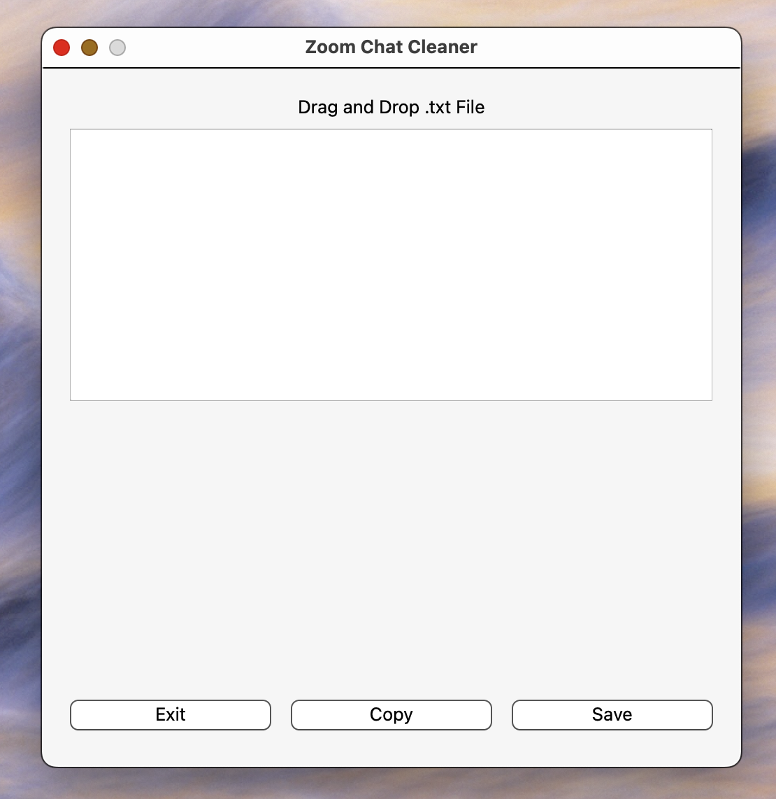

# README

## Zoom Chat Cleaner

Zoom Chat Cleaner is a graphical user interface (GUI) program for cleaning up Zoom chat logs.

The program reads in a `.txt` file of a Zoom chat log that contains time-stamps and chat messages, and outputs a cleaned version of the chat log in which only the chat messages remain.

The cleaned up chat log can then be saved as a new `.txt` file or copied to the clipboard for further use.




## Installation

The program is written in Python 3 and requires the following packages to be installed: `PyQt6`, `pyperclip`, and `re`.

These packages can be installed using `pip`:

```bash
pip install PyQt6 pyperclip
```

## Usage

To use the program, run the `zoom_chat_cleaner.py` file.

When the program starts, a window with a label saying "Drag and Drop .txt File" will appear. You can drag and drop a `.txt` file containing a Zoom chat log onto this window. The program will then clean the chat log and display the cleaned version in the text area below the label.

You can use the "Copy" button to copy the cleaned chat log to the clipboard or the "Save" button to save it as a new `.txt` file. The "Exit" button can be used to close the program.

Note: The program only accepts `.txt` files, and the file must contain time-stamps followed by chat messages for it to work correctly.

## License

This project is provided under the [MIT License](https://opensource.org/licenses/MIT).
